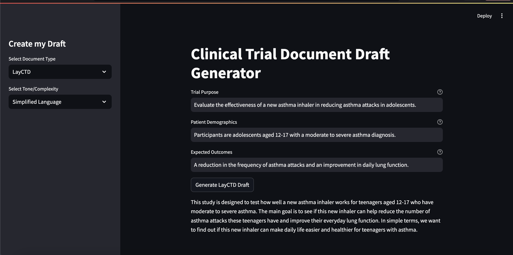

# CreateMyDraft

The aim of this project is to help users create drafts for essential clinical trial documents, specifically Lay Clinical Trial Documents (LayCTDs) and Informed Consent Forms (ICFs). Using ChatGPT-4 through LangChain, it allows users to generate drafts tailored to different content details and tones, like simplified language, technical details or detailed explanations. Each draft is saved in a database to keep track of the most commonly generated drafts and support analysis of usage trends. This approach makes it easier and faster to prepare clinical trial documents, supporting clear communication and efficient document management.

## Roadmap

- Screenshot

- App Overview

- Prerequisites

- Getting Started

- Author

## Screenshot



## App Overview

### Document Types and Input Details:

- **LayCTD (Lay Clinical Trial Document)**:
   - **Trial Purpose**: A brief description of the main goal of the clinical trial.
   - **Patient Demographics**: Key details about the participants, such as age range and medical condition.
   - **Expected Outcomes**: Summary of anticipated results or potential benefits from the trial.

- **ICF (Informed Consent Form)**:
   - **Participant Information**: General overview of the participant eligibility criteria and trial context.
   - **Study Risks**: Details about any potential risks involved in the study.
   - **Study Benefits**: Description of possible benefits to participants.
   - **Study Duration**: Expected length of the study, for example, 6 months.

## Prerequisites

- Python 3
- OpenAI
- LangChain
- SQLite
- Docker

## Getting Started

### Install Dependencies

```bash
pip install -r requirements.txt
```

### Start the Application

```bash
streamlit run main.py 
```

### Alternative: Docker Hub

The app is also available on Docker Hub. To use the Docker image, simply pull it using the following command:
```bash
docker pull agnir/createmydraft
```

**Important:** After cloning the app, make sure to update `main.py` with your OpenAI API key. This key is necessary for generating content. In the Docker image, the API key is not included, so you will need to add yours manually:
```bash
llm = ChatOpenAI(model="gpt-4", api_key="your_key_goes_here")
```

## Author

- [Agni Ramadani](https://github.com/agniramadani)
