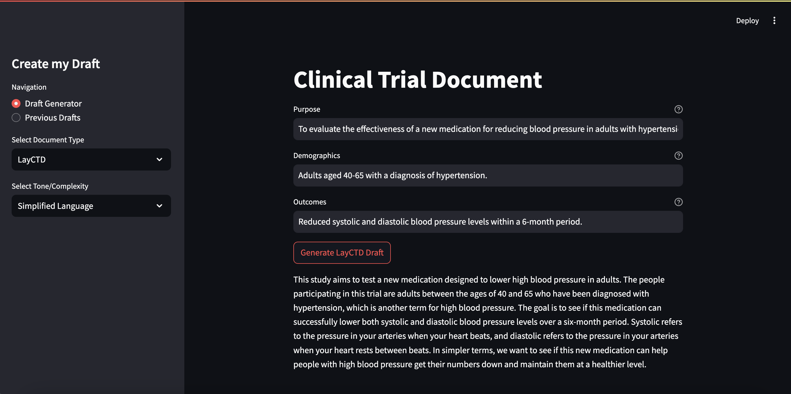

# CreateMyDraft

The aim of the project is to create clinical trial documents using LLMs, leveraging ChatGPT-4 and LangChain to enhance the drafting process for LayCTDs and ICFs.

## Roadmap

- Prerequisites

- Author

## Screenshot



## Prerequisites

- Python 3
- OpenAI
- LangChain
## Getting Started

### Install Dependencies
```bash
pip install -r requirements.txt
```

### Start the Application
```bash
streamlit run main.py 
```

## Author

- [Agni Ramadani](https://github.com/agniramadani)
